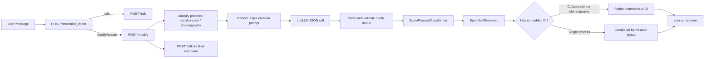

# BPMN Assistant: Detailed Application Description

## 1. What the application does

BPMN Assistant is a three-service web application that turns a natural-language process description into an editable BPMN diagram. It can also:

- create a single-process BPMN diagram;
- create a multi-pool BPMN collaboration with message flows;
- create a BPMN choreography focused on message exchanges between participants;
- modify an existing generated process or collaboration through natural-language instructions;
- explain the current model conversationally;
- import supported BPMN XML and reconstruct the application's internal JSON representation; and
- render and download the resulting BPMN XML.

The LLM does **not** generate BPMN XML directly. Its main modeling output is a constrained, application-specific JSON structure. Deterministic Python code validates that structure, derives sequence flows, and serializes it as standards-shaped BPMN XML.

The application does not fine-tune a model. It uses prompts assembled at request time from Jinja2 templates. Although this is sometimes described as “zero-shot prompting,” the creation templates include worked examples, so the current implementation is more precisely **prompt-only / zero-training generation with few-shot in-context examples**.

## 2. High-level architecture

| Component | Location | Responsibility |
| --- | --- | --- |
| Vue/Vite frontend | `src/bpmn_frontend/` | Chat UI, model selection, API-key collection, file upload, diagram rendering, and BPMN download |
| FastAPI backend | `src/bpmn_assistant/` | Intent classification, prompt rendering, LLM calls, JSON validation/editing, JSON↔XML conversion, and text responses |
| Layout service | `src/bpmn_layout_server/` | Adds BPMN Diagram Interchange (DI) coordinates to single-process XML using `bpmn-auto-layout` |
| LLM gateway | `core/llm_facade.py` and `core/provider_impl/litellm_provider.py` | Normalizes provider/model selection, JSON or text output mode, images, streaming, and LiteLLM calls |
| Prompt library | `prompts/*.jinja2` | Defines the internal BPMN JSON grammar, examples, classifications, editing tools, and conversational instructions |
| Model conversion | `services/bpmn_process_transformer.py` and `services/bpmn_xml_generator.py` | Flattens the nested LLM JSON and converts it to BPMN XML |
| Deterministic multi-party layout | `services/bpmn_layout_generator.py` | Embeds DI for collaborations and choreographies, which the JavaScript auto-layout service cannot handle |

Docker Compose starts the backend on port `8000`, the layout server on `3001`, and the frontend on `8080` (`docker-compose.yml`). The frontend defaults to those URLs in `src/bpmn_frontend/src/config.js`.

## 3. Internal BPMN JSON model

The model shared between the frontend and backend has one of three top-level shapes. `core/schemas.py:model_type()` identifies the shape by key presence.

### Single process

```json
{
  "process": [
    { "type": "startEvent", "id": "start" },
    { "type": "userTask", "id": "review", "label": "Review request" },
    { "type": "endEvent", "id": "end" }
  ]
}
```

After creation, `BpmnModelingService.create_bpmn()` unwraps this object and stores/returns the `process` array itself for backward compatibility.

### Collaboration

```json
{
  "participants": [
    { "id": "buyer", "name": "Buyer", "process": [] },
    { "id": "seller", "name": "Seller", "process": [] }
  ],
  "message_flows": [
    {
      "id": "message_1",
      "sourceRef": "send_order",
      "targetRef": "receive_order",
      "label": "Order"
    }
  ]
}
```

Each non-empty participant process uses the same nested grammar as a single process. An empty process represents a black-box pool.

### Choreography

```json
{
  "participants": [
    { "id": "buyer", "name": "Buyer" },
    { "id": "seller", "name": "Seller" }
  ],
  "choreography": [
    { "type": "startEvent", "id": "start" },
    {
      "type": "choreographyTask",
      "id": "submit_order",
      "name": "Submit order",
      "initiator": "buyer",
      "recipient": "seller",
      "message": "Order"
    },
    { "type": "endEvent", "id": "end" }
  ]
}
```

For all three shapes, normal sequence is represented by array order. Exclusive and inclusive gateway branches contain nested `path` arrays; parallel gateways contain arrays of branch arrays. A branch can use `next` to target another element, including an earlier element for a loop. The LLM does not normally emit explicit `sequenceFlow` objects.

## 4. End-to-end natural-language creation flow



The concrete request path is:

1. `ChatInterface.vue:handleMessageSubmit()` adds the user's text and optional base64 image data to the browser-side `messages` array.
2. The frontend calls `POST /determine_intent` from `ChatInterface.vue:determineIntent()`.
3. `services/determine_intent.py:determine_intent()` renders `prompts/determine_intent.jinja2` and asks the LLM for `{"intent": "modify"}` or `{"intent": "talk"}`.
4. For a creation request, the current `process` is `null`, so the frontend calls `POST /modify` with the full message history, selected model, API keys, and `process: null`.
5. `app.py:_modify()` creates a JSON-mode LLM facade. Because no process exists yet, it creates a separate facade and calls `services/determine_diagram_type.py:determine_diagram_type()`.
6. `prompts/determine_diagram_type.jinja2` classifies the description as `process`, `collaboration`, or `choreography`. The separate facade keeps classifier messages out of the generation conversation.
7. `BpmnModelingService.create_bpmn()` selects the creation template:
   - `create_choreography.jinja2` when the classifier explicitly returns `choreography`;
   - `create_bpmn.jinja2` for both `process` and `collaboration`. This general prompt can self-select among all three shapes.
8. The chosen Jinja2 template is rendered with the text message history. Any uploaded images are not interpolated into the template; they are attached as image content when `LLMFacade.call()` builds the provider message.
9. LiteLLM calls the selected provider in JSON mode. The returned string is parsed into a Python dictionary.
10. `validate_model()` verifies the detected top-level shape and its BPMN constraints. If parsing or validation fails, creation retries up to three times, sending a short error correction prompt on the same facade/message history.
11. A legacy `{"process": [...]}` response is unwrapped to a list. Collaboration and choreography objects remain dictionaries.
12. **The validated JSON is translated to XML at `app.py:130`, where `_modify()` calls `bpmn_xml_generator.create_bpmn_xml(process)`.** The detailed conversion is described in section 6.
13. The backend adds embedded DI coordinates for a collaboration or choreography, then returns both forms:

   ```json
   {
     "bpmn_xml": "<definitions ...>...</definitions>",
     "bpmn_json": {}
   }
   ```

14. `ChatInterface.vue:modify()` emits the JSON into the application's `process` state and the XML to `HomeView.vue:handleBpmnXml()`.
15. A collaboration or choreography already contains `BPMNDiagram`, so it is imported directly. A single process is sent to the layout server's `POST /process-bpmn` endpoint first.
16. `chor-js` imports the final XML, fits the diagram to the viewport, and provides the modeler used for manual interaction and download.
17. Finally, the frontend calls `POST /talk` with `needs_to_be_final_comment: true`. `make_final_comment.jinja2` asks a text-mode LLM to briefly describe the completed change without exposing the JSON.

## 5. How prompting is done

### 5.1 Template rendering

All prompt loading goes through `prompts/prompt_template_processor.py:PromptTemplateProcessor`:

- `FileSystemLoader` loads templates from the `prompts/` directory;
- `trim_blocks=True` and `lstrip_blocks=True` reduce template whitespace;
- `render_template(template_name, **kwargs)` passes runtime values to Jinja2;
- Jinja2 `` statements compose large prompts from shared grammar and example files.

`utils/utils.py:message_history_to_string()` converts structured messages into lines such as `User: ...` and `Assistant: ...`. Templates receive this flattened transcript as `message_history`. Current JSON is generally inserted with `str(process)`, so it appears as a Python-style list/dictionary representation inside fenced sections.

### 5.2 Prompt inventory

| Template | Called from | Output expected | Purpose |
| --- | --- | --- | --- |
| `determine_intent.jinja2` | `services/determine_intent.py` | JSON | Routes the last message to model modification/creation or normal conversation |
| `determine_diagram_type.jinja2` | `services/determine_diagram_type.py` | JSON | Classifies a new model as process, collaboration, or choreography |
| `create_bpmn.jinja2` | `BpmnModelingService.create_bpmn()` | JSON | General creation prompt; includes the full representation plus process, collaboration, and choreography examples |
| `create_choreography.jinja2` | `BpmnModelingService.create_bpmn()` | JSON | Constrains an explicitly classified choreography to the choreography shape |
| `bpmn_representation.jinja2` | Included by creation/edit prompts | N/A | Defines supported tasks, events, gateway nesting, collaborations, message flows, and choreography JSON grammar |
| `choreography_representation.jinja2` | Included by the dedicated choreography prompt | N/A | Defines choreography participants, tasks, messages, events, gateways, and ordering rules |
| `bpmn_examples.jinja2` | Included prompt fragment | N/A | Worked examples for sequential, branching, looping, and parallel processes |
| `bpmn_collaboration_examples.jinja2` | Included prompt fragment | N/A | Worked multi-pool/message-flow examples |
| `bpmn_choreography_examples.jinja2` | Included prompt fragment | N/A | Worked choreography examples |
| `define_change_request.jinja2` | `process_editing/define_change_request.py` | Text | Turns a user's edit request into a concise plan of editing-function calls |
| `edit_bpmn.jinja2` | `BpmnEditingService._apply_initial_edit()` | JSON | Requests the first deterministic edit function and its arguments |
| `edit_bpmn_intermediate_step.jinja2` | `BpmnEditingService._apply_intermediate_edits()` | JSON | Supplies updated JSON and asks for the next function or `{"stop": true}` |
| `respond_to_query.jinja2` | `ConversationalService.respond_to_query()` | Streamed text | Answers BPMN questions using the current process as hidden context |
| `make_final_comment.jinja2` | `ConversationalService.make_final_comment()` | Streamed text | Summarizes a completed create/edit operation |

### 5.3 LLM facade and provider behavior

`utils/utils.py:get_llm_facade()` maps the selected model to OpenAI, Anthropic, Google, or Fireworks and chooses a user-supplied key before an environment key. It creates `LLMFacade` with either JSON mode (classifiers, generation, edit proposals) or text mode (change-plan text and conversational output).

`core/llm_facade.py` maintains the messages for one logical call sequence. In JSON mode, the provider starts with a small system message saying that the assistant outputs JSON. Each rendered prompt is appended as a user message; images are represented as `image_url` items alongside prompt text. The provider currently rejects images for non-OpenAI models.

`core/provider_impl/litellm_provider.py:LiteLLMProvider.call()` sends the request through `litellm.completion()` and sets:

```python
response_format = {"type": "json_object"}
```

when JSON output or a `structured_output` class is requested. The Pydantic class is used as a signal to request JSON, but this provider does not pass a full JSON schema to LiteLLM. Shape and domain validation therefore happen in the service layer after parsing.

The provider first tries strict `json.loads()`. If that fails, `core/json_parser.py:parse_json_loose()` tries fenced JSON blocks and the first decodable object/array embedded in surrounding text. JSON mode still requires the final parsed value to be a dictionary.

GPT-5.2 is forced to temperature `1`; other calls use the temperature supplied by each service. Conversational calls use LiteLLM streaming and return fragments through FastAPI's `StreamingResponse`.

## 6. Where and how JSON is translated to BPMN XML

This is the key conversion boundary:

> `src/bpmn_assistant/app.py:130` → `bpmn_xml_generator.create_bpmn_xml(process)`

The implementation is in `src/bpmn_assistant/services/bpmn_xml_generator.py`, beginning with `BpmnXmlGenerator.create_bpmn_xml()` at line 28.

The conversion has two deterministic stages.

### Stage A: nested JSON to flat elements and flows

`services/bpmn_process_transformer.py:BpmnProcessTransformer.transform()` converts the compact, nested prompt representation into:

```json
{
  "elements": [
    {
      "id": "review",
      "type": "userTask",
      "label": "Review request",
      "incoming": ["start-review"],
      "outgoing": ["review-end"]
    }
  ],
  "flows": [
    {
      "id": "start-review",
      "sourceRef": "start",
      "targetRef": "review",
      "condition": null
    }
  ]
}
```

During this stage the transformer:

- derives normal sequence flows from array order;
- recursively flattens nested gateway branches;
- honors branch `next` targets;
- adds generated join gateways for parallel gateways and for exclusive/inclusive gateways with `has_join: true`;
- marks an inclusive gateway's default sequence flow;
- carries event definitions forward; and
- calculates every element's `incoming` and `outgoing` flow IDs.

The same transformer is reused for each participant process in a collaboration and for the `choreography` array.

### Stage B: flat structure to XML

`BpmnXmlGenerator.create_bpmn_xml()` calls `core/schemas.py:model_type()` and dispatches as follows:

- **Process:** creates `<definitions>` and one `<process id="Process_1">`, appends each task/event/gateway and each `<sequenceFlow>`, then serializes the tree with `xml.etree.ElementTree.tostring()`.
- **Collaboration:** `create_collaboration_xml()` creates `<collaboration id="Collaboration_1">`, `<participant>` pool entries, top-level `<messageFlow>` entries, and one sibling `<process>` for every non-black-box participant.
- **Choreography:** `create_choreography_xml()` creates global `<message>` definitions, a `<choreography>`, participant bands, choreography-level message flows, `<choreographyTask>` nodes with `participantRef`/`messageFlowRef`, and derived sequence flows.

The exact XML-writing helpers are:

- `_create_root()` for BPMN/BPMNDI/DC/DI namespaces;
- `_append_process()` for a process container;
- `_append_element()` for tasks, events, and gateways;
- `_append_choreography_task()` and `_append_message_flow()` for choreography-specific XML; and
- `_append_flows()` for `<sequenceFlow>` elements.

The LLM is therefore responsible for semantic modeling and supplies the element IDs in JSON. Deterministic code derives flow and join IDs, builds the XML nodes, and calculates most layout data.

## 7. Validation and retry behavior

`services/validate_bpmn.py:validate_model()` dispatches validation by top-level type.

For a normal process it checks, among other rules:

- supported element types;
- required IDs, task labels, gateway fields, and branch shapes;
- exactly one top-level start event;
- at least one end event, including one nested in a branch; and
- transformability by `BpmnProcessTransformer`.

For a collaboration it validates each non-empty participant process, unique participant IDs, required message-flow fields, and whether message-flow endpoints reference known elements or participant IDs.

For a choreography it requires at least two participants, a non-empty choreography, valid participant references on every choreography task, one start event, an end event, and otherwise valid gateway/element structure.

Creation retries at most three times. Diagram-type and intent classification also retry at most three times. Editing allows up to four attempts for each proposal and at most fifteen sequential editing-function iterations. Error prompts are appended to the same facade so the LLM retains the preceding prompt/response context.

## 8. Existing-model editing flow

When `POST /modify` receives a non-empty `process`, it uses `BpmnModelingService.edit_bpmn()` rather than creating a model from scratch.

1. The endpoint creates two facades for the same selected model: JSON mode for edit proposals and text mode for interpreting the requested change.
2. `define_change_request.jinja2` receives the current JSON, full conversation, BPMN grammar, examples, and available edit functions. It returns a concise natural-language change plan.
3. `edit_bpmn.jinja2` receives the model and plan, then requests one JSON function call such as `add_element`, `delete_element`, `move_element`, `update_element`, or `redirect_branch`.
4. `BpmnEditingService` validates the proposed function/arguments and calls deterministic Python functions in `services/process_editing/functions.py`.
5. For collaborations it can target a participant process with `participant_id` and can also add/delete participants or message flows through `collaboration_functions.py`.
6. The updated model is validated after every operation.
7. `edit_bpmn_intermediate_step.jinja2` feeds the new model back to the LLM. The model returns another single function call or `{"stop": true}`.
8. Once editing stops, the updated JSON follows the same `BpmnXmlGenerator.create_bpmn_xml()` conversion path as a newly created model.

The editing implementation explicitly specializes normal processes and collaborations. A choreography is accepted by the API's broad request type, but `BpmnEditingService` does not route element edits into the choreography's `choreography` array. Choreography creation/rendering is implemented; reliable choreography editing is not currently implemented by this edit-function pipeline.

## 9. Layout and rendering

The XML serializer initially creates semantic BPMN XML. Visual coordinates are added in one of two ways.

### Single process

The backend returns XML without a `BPMNDiagram` block. `HomeView.vue:handleBpmnXml()` detects this and calls `HomeView.vue:processDiagram()`, which POSTs the XML to `src/bpmn_layout_server/server.js:/process-bpmn`. The Node service calls `bpmn-auto-layout.layoutProcess()` and returns `layoutedXml`.

### Collaboration and choreography

`app.py:_modify()` detects these shapes with `model_type()` and calls `BpmnLayoutGenerator.add_di()` at `app.py:136`. The Python layout generator ranks the derived flow graph, assigns stable element coordinates, creates pool or participant-band shapes, routes sequence/message edges, and splices a `<bpmndi:BPMNDiagram>` block before `</definitions>`.

The frontend sees `BPMNDiagram` in the XML and skips the JavaScript layout service. Both paths end at `HomeView.vue:importDiagram()`, which imports XML into the global `chor-js` modeler and zooms to fit.

## 10. Conversation-only path

If intent classification returns `talk`, the frontend does not regenerate XML. It calls `POST /talk` with the current JSON model, message history, model, API keys, and `needs_to_be_final_comment: false`.

`ConversationalService.respond_to_query()` renders `respond_to_query.jinja2`. If a model exists, the prompt includes it as private context and tells the LLM not to expose JSON fields or element IDs. The response is streamed to the browser and appended to the most recent assistant message.

After a successful create/edit operation, the same endpoint uses `make_final_comment.jinja2` instead. The frontend retries a final-comment stream once for idle, total-timeout, or empty-stream failures and displays a fallback completion message if the retry also fails.

## 11. BPMN XML import: the reverse direction

Dragging a `.bpmn` file onto the diagram canvas takes the reverse path:

1. `HomeView.vue:handleDrop()` reads and displays the XML.
2. `HomeView.vue:createBpmnJson()` sends it to `POST /bpmn_to_json`.
3. `app.py:_bpmn_to_json()` calls `BpmnJsonGenerator.create_bpmn_json()`.
4. `services/bpmn_json_generator.py` parses XML with `ElementTree.fromstring()`, collects supported elements/flows, traverses from the single start event, reconstructs nested gateway branches, and returns the internal JSON.
5. If a `<collaboration>` exists, it rebuilds participants, their referenced processes, and message flows.

The importer looks for a `<collaboration>` or a `<process>`; it does not have a choreography parser. Imported process/collaboration XML must also fit the supported subset and structural assumptions documented in `BpmnJsonGenerator`.

## 12. FastAPI endpoint summary

| Endpoint | Request purpose | Main result |
| --- | --- | --- |
| `GET /` | Health check | `{"status": "ok"}` |
| `POST /available_providers` | Check which API keys/providers are available | Provider availability map |
| `POST /determine_intent` | Route a message to create/edit or conversation | `{"intent": "modify" | "talk"}` |
| `POST /modify` | Create or edit a BPMN model | Both `bpmn_json` and `bpmn_xml` |
| `POST /talk` | Explain a model, converse, or comment after an edit | Streamed text |
| `POST /bpmn_to_json` | Import supported BPMN XML | Internal process/collaboration JSON |

Request schemas live in `api/requests.py`. API keys may be included per request for the hosted bring-your-own-key flow; otherwise the backend reads provider keys from `.env`.

## 13. State and practical limitations

- The authoritative semantic state used for later prompts is the last JSON returned by the backend and stored as `HomeView.process`.
- Manual changes made directly in the `chor-js` canvas do not update that JSON. Subsequent LLM edits therefore operate on the last generated/imported representation, not arbitrary visual edits.
- The app supports only the element and event-definition subset enumerated by `core/enums/bpmn_element_type.py` and described in `bpmn_representation.jinja2`.
- Images are flattened from the entire message history and attached to LLM calls; the provider layer currently permits them only for OpenAI models.
- Generation is stochastic and provider-dependent even though parsing, validation, transformation, XML serialization, and layout are deterministic after a valid JSON model is obtained.
- Single-process layout uses the external Node service, whereas collaboration/choreography layout is simpler deterministic Python layout.
- BPMN XML import supports processes and collaborations but not choreography XML.
- The current edit-function pipeline supports processes and collaborations, not reliable choreography edits.

## 14. Most important code pointers

- **Prompt rendering:** `src/bpmn_assistant/prompts/prompt_template_processor.py:6-30`
- **Main creation prompt selection and LLM call:** `src/bpmn_assistant/services/bpmn_modeling_service.py:25-77`
- **Diagram-type classifier prompt:** `src/bpmn_assistant/services/determine_diagram_type.py:25-73`
- **LLM JSON/text handling:** `src/bpmn_assistant/core/llm_facade.py:65-123`
- **LiteLLM call and JSON parsing:** `src/bpmn_assistant/core/provider_impl/litellm_provider.py:51-166`
- **Validation:** `src/bpmn_assistant/services/validate_bpmn.py:18-321`
- **JSON → XML call site:** `src/bpmn_assistant/app.py:130`
- **JSON → flat elements/flows:** `src/bpmn_assistant/services/bpmn_process_transformer.py:9-268`
- **Flat model → BPMN XML:** `src/bpmn_assistant/services/bpmn_xml_generator.py:28-278`
- **Collaboration/choreography DI injection:** `src/bpmn_assistant/app.py:132-136` and `src/bpmn_assistant/services/bpmn_layout_generator.py:56-358`
- **XML → JSON import:** `src/bpmn_assistant/services/bpmn_json_generator.py:30-582`
- **Frontend request orchestration:** `src/bpmn_frontend/src/components/ChatInterface.vue:315-668`
- **Frontend layout/render/import:** `src/bpmn_frontend/src/views/HomeView.vue:54-160`
